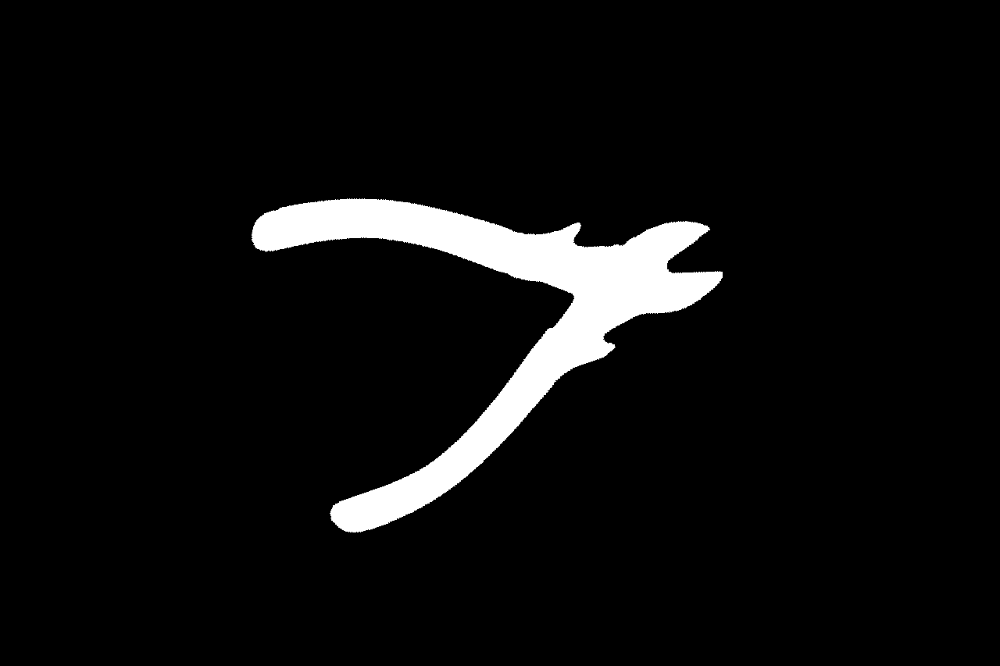

 

## step 1

J'ai décider de concentrer mon travail sur la tenaille pour ce TP(image 2063 à 2667).


## STEP 2

J'ai réaliser deux fonctions me permettant d'extraire les objets digitaux des images selon une adjacence 4, 8 et de garder uniquement le plus grand des objets identifié.

```cpp
ObjectType48 largerComponentObjectFromImage(const ImageType& image) {

    Z2i::DigitalSet set2d(image.domain());
    SetFromImage<Z2i::DigitalSet>::append<ImageType>(set2d, image, 1, 255);

    // Create a digital object from the digital set(4,8) adjacency
    vector<ObjectType48> objects48;
    back_insert_iterator<vector<ObjectType48>> inserter48(objects48);

    ObjectType48 connectedComponents48(dt4_8, set2d);
    connectedComponents48.writeComponents(inserter48);

    return keepLargerComponent(objects48); // keep only larger component
}
```

```cpp
const ObjectType48& keepLargerComponent(const vector<ObjectType48>& objs) {
    size_t maxId = 0;
    for(size_t i = 0; i < objs.size(); i++) {
        if(objs[i].size() > objs[maxId].size()) {
            maxId = i;
        }
    }
    return objs[maxId];
}
```


## STEP 3

Pour l'estimation de la translation j'ai utilisé uniquement la méthode des centres de masse qui me donne les translations successives suivante.

| numéro de l'image | translation avec l'image précédente |
| ----------------- | ----------------------------------- |
| 2064              | {-20, 22}                           |
| 2065              | 61, -26}                            |
| 2066              | {-8, -35}                           |
| 2067              | {-31, 4}                            |

Pour l'estimation de la rotation j'ai utilisé la méthode 2 avec une analyse par composantes principales (ACP) en utilisant la librairie Eigen pour extraites le vecteur propre principale de la matrice de covariance.

| numéro de l'image | rotation avec l'image précédente (en radian) |
| ----------------- | -------------------------------------------- |
| 2064              | -0.335981                                    |
| 2065              | -0.368947                                    |
| 2066              | -0.423779                                    |
| 2067              | -0.606316                                    |

## STEP 4

J'ai ensuite appliqué sur chaque images la rotation et la translation correspondante pour essayer de revenir à la position de limage 2063. J'ai opté pour une backward transformation qui permet de couvrir toute l'image d'arrivée. A l'inverse une forward transformation n'est pas surjective et peut créer des "trous" dans l'image transformée.

Voilà les résultats obtenus :

IMG_2763


IMG_2764_motionTo2763



IMG_2765_motionTo2763


IMG_2766_motionTo2763


## STEP 5


La complexité du calcul de la distance de Hausdorff étant de O(X.Y) il est impossible de la calculer en temps raissonable avec un algorithme naïf.
J'ai utilisé l'algorithme présenté ici (https://cs.stackexchange.com/questions/117989/hausdorff-distance-between-two-binary-images-according-to-distance-maps )pour pouvoir réduire la complexité à O(X+Y) en utilisant la carte de distance fourni via la librairie DGtal.

J'ai calculé pour toutes les transformation précédant les distances correspondantes avant et après transformation.

| image        | translation | rotation | hausdorff disance (before / after) | Dubuisson & jain (before / after) |
| ------------ | ----------- | -------- | ---------------------------------- | --------------------------------- |
| 2764 to 2063 | {20, -22}   | 0.335981 | 150.073 / 11.3137                  | 34.3712 / 0.286351                |
| 2065 to 2063 | {-41, 4}    | 0.704928 | 174.347 / 26.1725                  | 63.7067 / 1.53725                 |
| 2066 to 2063 | {-33, 39}   | 1.12871  | 211.981 /  36.7967                 | 70.4975 / 2.9271                  |
| 2067 to 2063 | {-2, 35}    | 1.73502  | 177.071 /  41.1096                 | 40.8907 / 3.74951                 |

On observe bien que après rotation, les distances  (Hausdorff  et Dubuisson-Jain) se rapprochent effectivement de 0 (qui signifierai deux images identiques).
La distance de Dubuisson & jain ( qui considère une moyenne des écart de distance plutôt que de prendre uniquement le max) semple plus pertinente dans le sens ou elle permet d’éviter les points aberrants par l'utilisation d'une moyenne. 

On peut  également remarquer que plus la rotation à effectuer est importante plus la distance mesurée après transformation est importante. C'est sûrement dû à une imprécision de la méthode de mesure de la rotation qui est perfectible (notamment avec la méthode de Kabsch que je n'ai pas eu le temps d’implémenter).


Néanmoins, malgré des distances non nulles les résultats semblent plutôt bon visuellement en observant les images transformées et l’image cible (visible ci dessus  (step 4)).

## annexes

Code disponible sur github via le liens suivant : https://github.com/dsmtE/IMAC_DiscreteGeometr